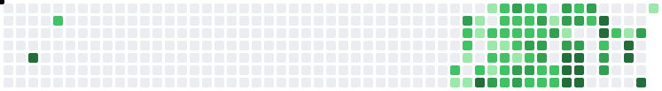
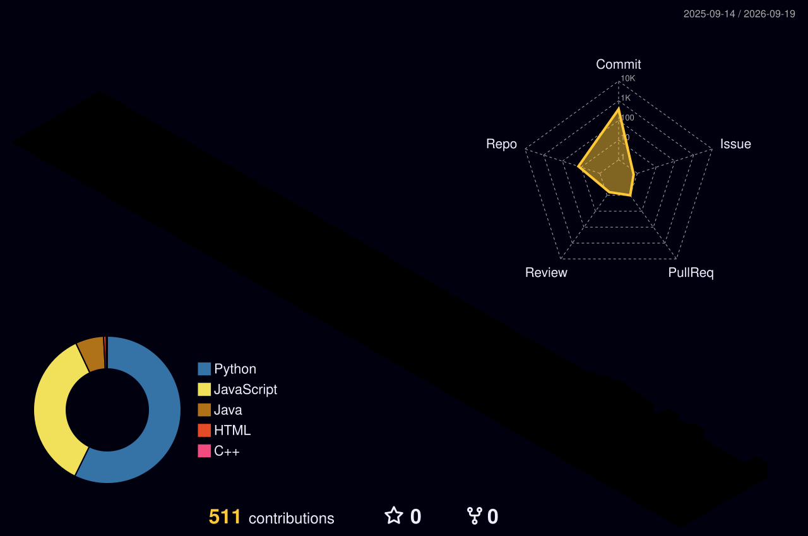

 

Building LLM-powered applications, autonomous agent systems, and production-oriented backend services.

 

&nbsp;&nbsp;&nbsp;

 

---

### 👤 About Me

- 🎓 Computer science major
- 💻 Building AI-powered applications and backend systems
- 🧠 Exploring LLMs, RAG, AI agents, and system design
- ⚙️ Focused on building reliable, maintainable, and production-oriented software
- 🔍 Interested in how real-world systems are designed, deployed, and scaled
- 🌱 Continuously learning through hands-on development and open-source contributions
- 📂 All projects → [codeitanshika](https://github.com/codeitanshika?tab=repositories)
- 🤝 Open to open-source contributions and engineering collaborations
- 📫 Reach me → [anshika494shiv@gmail.com](mailto:anshika494shiv@gmail.com)

---

### 🛠️ Selected Projects

<table>
<tr>
<td width="50%">

**[clearbid](https://github.com/codeitanshika/clearbid)**

AI-powered tender evaluation platform. Extracts criteria from tender PDFs, scores bidder documents against those criteria automatically.

`React` `FastAPI` `LLM`

</td>
<td width="50%">

**[Self-Healing E-commerce Microservices](https://github.com/codeitanshika/Self-Healing-E-commerce-microservices)**

Closed-loop reliability agent — AI agents detect, diagnose, fix, and verify failures in e-commerce microservices autonomously.

`Python` `Agents`

</td>
</tr>
<tr>
<td width="50%">

**[codesage](https://github.com/codeitanshika/codesage)**

RAG-based code search — ask a GitHub codebase questions in plain English, get answers with exact file/line references.

`Python` `RAG` `Embeddings`

</td>
<td width="50%">

**[Resume-Analyzer](https://github.com/codeitanshika/Resume-Analyzer)**

Generates ATS compatibility scores and personalized feedback from resume analysis.

`Python` `NLP`

</td>
</tr>
</table>

---

### ⚙️ Tech Stack

<table>
<tr>
<td valign="top" width="50%">

<b>🧑‍💻 Languages</b>

 

</td>
<td valign="top" width="50%">

<b>🖥️ Backend & Frameworks</b>

 

</td>
</tr>
<tr>
<td valign="top" width="50%">

<b>🎨 Frontend</b>

 

</td>
<td valign="top" width="50%">

<b>🤖 AI / ML</b>

 

</td>
</tr>
<tr>
<td valign="top" width="50%">

<b>🗄️ Databases</b>

 

</td>
<td valign="top" width="50%">

<b>☁️ Cloud & DevOps</b>

 

</td>
</tr>
</table>

---

### 📊 GitHub Stats

<!-- Generated daily by .github/workflows/grs.yml -->

---

### 🐍🌌 Contributions

<!-- Snake generated daily by .github/workflows/snake-wall.yml -->
<!-- 3D graph generated daily by .github/workflows/profile-3d-contrib.yml -->

<picture>
  <source media="(prefers-color-scheme: dark)" srcset="./profile/snake-wall-dark.svg" />
  
</picture>

---

Thanks for stopping by ✨

